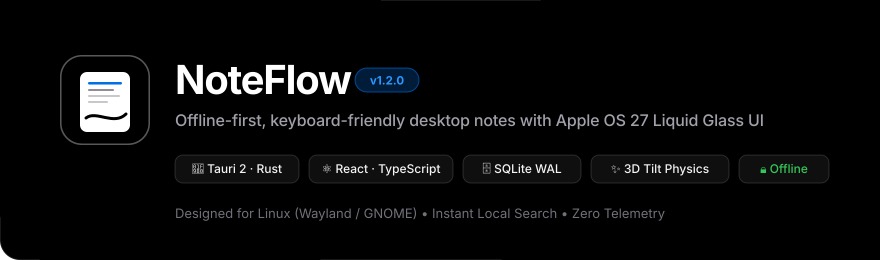

<p align="center">
  
</p>

<p align="center">
  <a href="https://github.com/imitravanu/Noteflow/releases/tag/v1.3.0"></a>
  <a href="https://github.com/imitravanu/Noteflow/releases/download/v1.3.0/noteflow_1.3.0_amd64.deb"></a>
  <a href="https://www.linux.org/"></a>
  <a href="https://tauri.app/"></a>
  <a href="https://www.rust-lang.org/"></a>
  <a href="https://react.dev/"></a>
  <a href="https://www.typescriptlang.org/"></a>
  <a href="https://www.sqlite.org/"></a>
  <a href="LICENSE"></a>
</p>

<p align="center">
  <b>NoteFlow</b> is a fast, offline-first, keyboard-centric notes app for the Linux desktop.<br>
  Engineered with <b>Tauri 2 · Rust · React · TypeScript · SQLite</b>, featuring an <b>Apple OS 27 Liquid Glass</b> design system, hardware-accelerated 3D perspective tilt, and dynamic cursor-tracking specular lighting.
</p>

---

## ✨ Features at a Glance

### 🧲 Living 3D Perspective Tilt & Specular Spotlights
- **Dynamic 3D Tilt:** Hardware-accelerated perspective tilt (`perspective: 1000px`) that pitches and rolls cards with mouse movement and smoothly springs back on mouse leave.
- **Dual-Layer Cursor Spotlight:** An interactive optical spotlight (sharp crystal specular core + chromatic halo) tracks the cursor across frosted glass in both **Light** and **Dark** modes.
- **Tactile Element Micro-Interactions:** Action pills, checklist capsules, tag chips, selection rings, and titles elevate and react organically when hovered.

### 💎 Apple OS 27 Liquid Glass Design System
- **Continuous Squircle Geometry:** Smooth continuous curvature with macOS-inspired precision radii.
- **Refractive Frosted Blur:** Deep multi-layer backdrop filters (`blur(28px) saturate(190%)`) with specular rim lighting and ambient luminous card glows.
- **Luminous Jewel Tints:** 8 vibrant color personalities (Default, Crimson Red, Amber Tangerine, Sun Gold, Emerald Apple Green, Cyan Ocean, Sapphire Blue, Electric Violet).
- **Adaptive Canvas Theme:** Seamless Light, Dark, and System theme synchronizations.

### ⚡ Offline-First SQLite Engine (Zero Telemetry)
- **Local SQLite Database (WAL Mode):** Reads and writes execute at sub-millisecond local speed via Rust and `rusqlite`.
- **Debounced Safe Autosave:** Real-time autosave indicator with zero data loss. `Ctrl+S` forces immediate SQLite flush.
- **100% Private:** Zero analytics, zero cloud lock-in, zero telemetry. Your notes stay exclusively on your hardware at `~/.local/share/com.noteflow.app/noteflow.db`.

### 🔍 Instant Spotlight Search (`Ctrl+K`)
- Substring and keyword search across title, body content, checklist items, and tags with real-time match highlighting.

### 🛡️ Safety, Multi-Select & Undo
- **Safety Stack:** Full undo stack (`Ctrl+Z`) and undo snackbar notifications.
- **Soft Trash Recovery:** Deleted notes move to Trash with 1-click restore or permanent delete confirmation.
- **Batch Selection:** Multi-select notes via `Shift+Click`, `Ctrl+Click`, or `Ctrl+A` for bulk tagging, coloring, archiving, or deletion.
- **Export & Backup:** Export individual notes as clean Markdown (`.md`) or export the entire workspace as JSON.

---

## ⌨️ Keyboard Shortcuts

| Shortcut | Action | Scope |
| :--- | :--- | :--- |
| <kbd>Ctrl</kbd> + <kbd>N</kbd> | Create new note | Global |
| <kbd>Ctrl</kbd> + <kbd>K</kbd> | Focus instant search | Global |
| <kbd>Ctrl</kbd> + <kbd>S</kbd> | Save / flush editor immediately | Editor |
| <kbd>Ctrl</kbd> + <kbd>Shift</kbd> + <kbd>P</kbd> | Toggle Pin status | Editor / Selection |
| <kbd>Ctrl</kbd> + <kbd>Shift</kbd> + <kbd>F</kbd> | Toggle Favorite (Star) | Editor / Selection |
| <kbd>Ctrl</kbd> + <kbd>Z</kbd> | Undo last action | Global |
| <kbd>Ctrl</kbd> + <kbd>A</kbd> | Select all notes | Grid |
| <kbd>Delete</kbd> | Move selected note(s) to Trash | Grid |
| <kbd>Esc</kbd> | Close Editor / Clear search / Exit selection | Modal / Global |
| <kbd>?</kbd> or <kbd>Ctrl</kbd> + <kbd>/</kbd> | Open Keyboard Shortcuts Cheat Sheet | Global |

---

## 🏗️ Architecture

```
┌────────────────────────────────────────────────────────┐
│               React 18 + TypeScript UI                 │
│      Zustand Stores · Apple OS 27 CSS Glass System     │
└──────────────────────────┬─────────────────────────────┘
                           │ Typed Tauri IPC Invoke
                           ▼
┌────────────────────────────────────────────────────────┐
│                   Tauri 2 / Rust Core                  │
│       Command Handlers · Validation · Business Logic   │
└──────────────────────────┬─────────────────────────────┘
                           │ rusqlite Connection
                           ▼
┌────────────────────────────────────────────────────────┐
│                  Local SQLite Database                 │
│         WAL Journaling · Foreign Keys · Migrations     │
│         Path: ~/.local/share/com.noteflow.app          │
└────────────────────────────────────────────────────────┘
```

```
src/                      React frontend
  components/             NoteCard, NoteEditor, TopBar, Sidebar, ShortcutsModal, SelectionBar…
  pages/                  NotesPage, SettingsPage
  hooks/                  useTheme, useKeyboardShortcuts, useAppInit
  store/                  Zustand state management (uiStore, notesStore)
  services/api.ts         Typed Tauri command invocations
  styles/                 Apple OS 27 design tokens (global.css) & components.css
  utils/                  Highlighting, undo stack, formatting, markdown exporter

src-tauri/src/            Rust backend
  commands/               Tauri command interfaces (notes, tags, settings)
  services/               Note & tag query operations and business logic
  database/               Connection management (WAL mode) & SQL migrations
  models/                 Note, Tag, ChecklistItem structs & patches
  error/                  Error mapping to user-friendly messages
```

---

## 🚀 Installation & Quick Start

### Option 1: 1-Click Install (.deb Package)
For **Ubuntu**, **Debian**, **Linux Mint**, **Pop!_OS**, and Debian-based distributions:

1. **Download the installer:**  
   👉 **[Download NoteFlow v1.3.0 (.deb)](https://github.com/imitravanu/Noteflow/releases/download/v1.3.0/noteflow_1.3.0_amd64.deb)** (2.6 MB)

2. **Install via terminal:**
   ```bash
   sudo dpkg -i noteflow_1.3.0_amd64.deb
   ```
   *Or simply double-click the `.deb` file in your Linux file manager (Nautilus/Dolphin).*

3. **Launch:**  
   Search for **NoteFlow** in your desktop application menu or run `noteflow` from the terminal.

---

### Option 2: Build from Source

#### Prerequisites
- Node.js 18+ and npm
- Rust 1.80+ (`curl --proto '=https' --tlsv1.2 -sSf https://sh.rustup.rs | sh`)
- Linux build dependencies (Debian/Ubuntu):
  ```bash
  sudo apt install libwebkit2gtk-4.1-dev build-essential curl wget file libxdo-dev libssl-dev libayatana-appindicator3-dev librsvg2-dev
  ```

#### Clone & Run
```bash
# Clone the repository
git clone https://github.com/imitravanu/Noteflow.git
cd Noteflow

# Install frontend dependencies
npm install

# Run Vite development server
npm run dev

# Run desktop application with live reload
npm run tauri dev
```

#### Quality & Tests
```bash
npm run typecheck    # TypeScript verification
npm test             # Vitest frontend tests
cd src-tauri && cargo test   # Rust SQLite integration tests
```

#### Build Production Executable
```bash
npm run build:app
```
Binaries are output to `src-tauri/target/release/noteflow`.

---

## 📄 License

This project is licensed under the [MIT License](LICENSE) — Copyright (c) 2026 Mitravanu.
